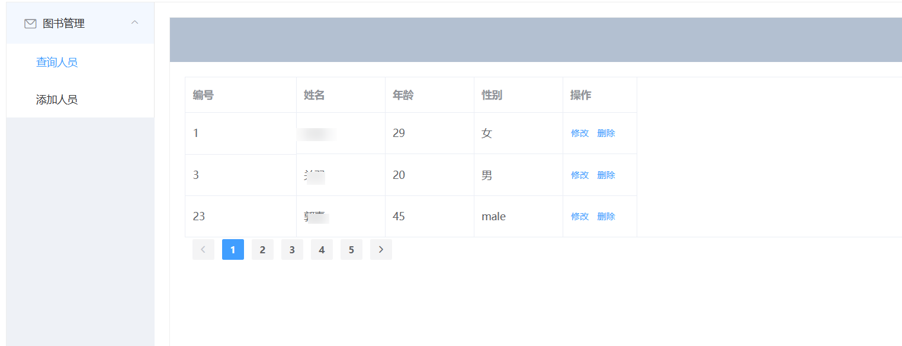
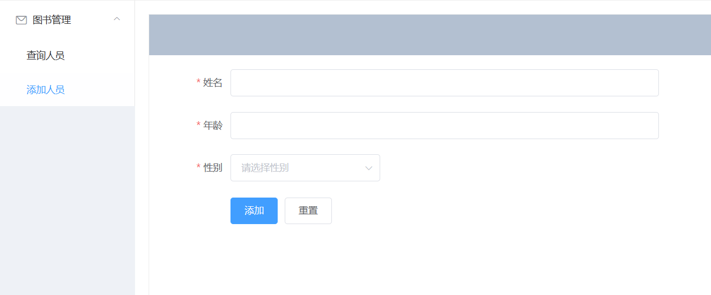
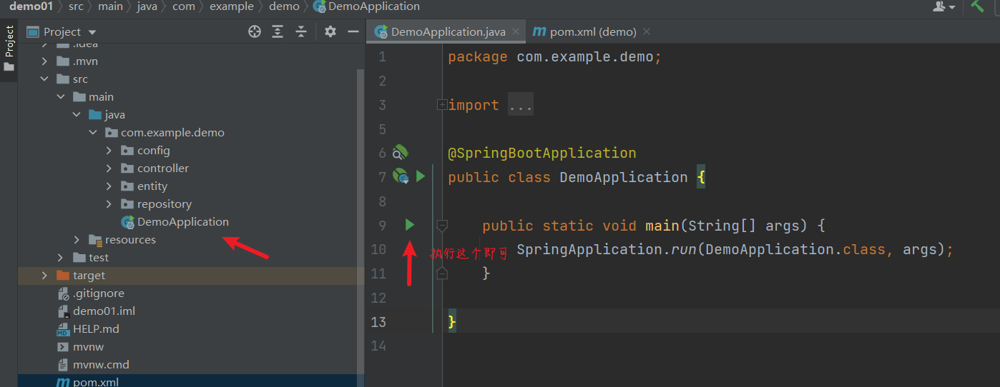
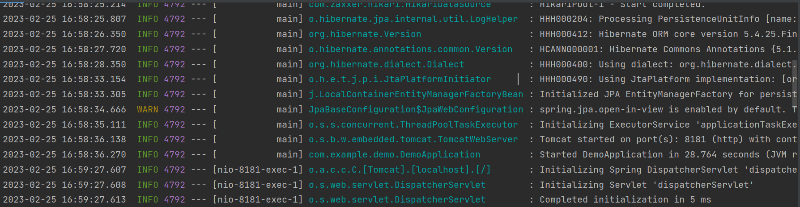
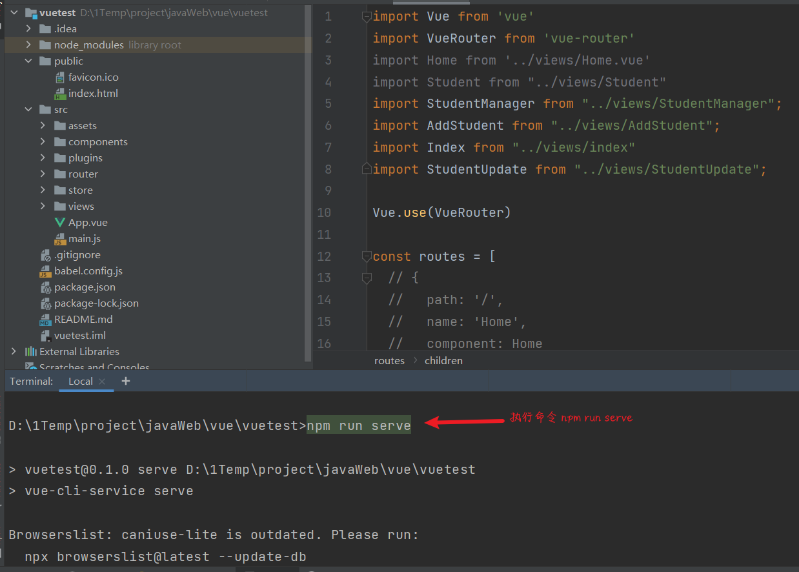
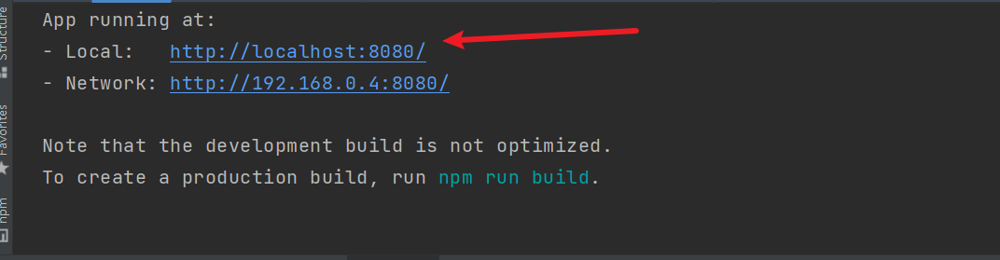
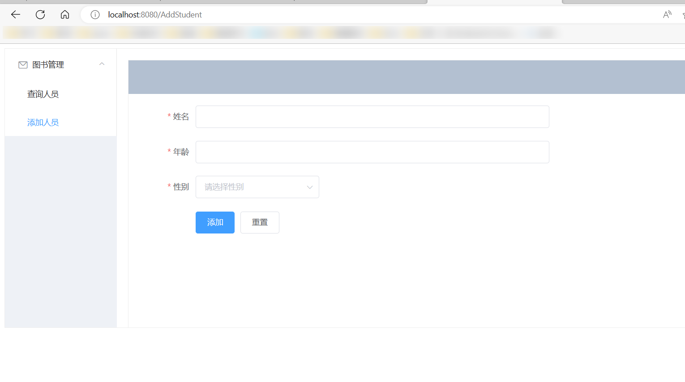

1、 项目展示

2、功能介绍

springboot + vue  + MySql 前后端分离，实现最简单的数据库增删改查的功能，通过前端页面的实现数据库的交互与实时展示。

3、用法

分别下载本工程下面的demo01和vuetest， 这两个目录分别是Springboot代码和vue代码。用idea分别打开这两个项目，注意分别打开的意思是最好用两个窗口单独打开。

启动springboot后端的方式：

第一次运行时可能需要加载pom下载相关依赖，可能会比较慢，同时这里需要配置完好的Maven环境。

成功的日志是这样的：

vue项目启动的方式：

前提是vue环境配置完毕，关于怎么配置vue环境，搭建vue教授杰脚手架，安装node.js和npm, 这个可以参考互联网教程，本项目不涉及环境配置。

启动成功的日志

直接浏览器中输入http://localhost:8080即可访问。

有问题可联系：2663017379@qq.com